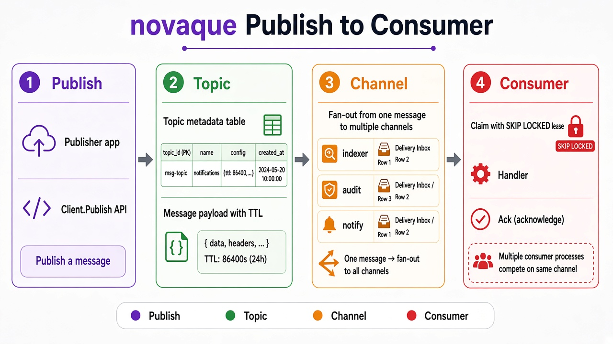

# novaque

Embeddable Go library for **topic → channel pub/sub** on a relational database.

You bring a `*sql.DB`; novaque runs in-process — no broker daemon. Topics fan out to channels; consumers on the same channel compete. Delivery is **at-least-once** with lease + ack (handlers must be idempotent).

## Why novaque?

Many apps already run a relational database. A separate message broker adds another cluster to operate. novaque keeps queue rows in that same DB — deployment stays **app + DB**, with transactional fan-out and safe multi-process claiming (`SKIP LOCKED` on MySQL/PostgreSQL; serializable transactions on SQLite).

| | |
|---|---|
| Topology | topic → channels (multicast); compete within a channel |
| Durability | MySQL ≥ 8.0.1, PostgreSQL ≥ 14, or SQLite ≥ 3.39.0 |
| Form | Go library + `store.Store` drivers (all three ship) |

## Architecture



**Publish** writes one message and one **delivery** per existing **channel**. **Consumers** **Claim** with a lease, run your handler, then **Ack** or **Requeue** (lease token required). Details: [docs/guide.md](docs/guide.md) and [workspace architecture diagrams](https://github.com/usual2970/novaque-workspace/blob/main/docs/architecture/novaque-architecture-and-dataflow.md).

## Install

```bash
go get github.com/usual2970/novaque
```

Requires **Go 1.26.5+**.

## Quick start (MySQL)

```go
package main

import (
	"context"
	"database/sql"
	"log"
	"time"

	_ "github.com/go-sql-driver/mysql"

	"github.com/usual2970/novaque"
	"github.com/usual2970/novaque/driver/mysql"
)

func main() {
	db, err := sql.Open("mysql",
		"user:pass@tcp(127.0.0.1:3306)/app?parseTime=true&loc=UTC")
	if err != nil {
		log.Fatal(err)
	}
	db.SetMaxOpenConns(32)

	client, err := novaque.Open(mysql.New(db), novaque.Options{MaxInFlight: 8})
	if err != nil {
		log.Fatal(err)
	}
	ctx := context.Background()
	if err := client.Migrate(ctx); err != nil {
		log.Fatal(err)
	}
	if err := client.Start(ctx); err != nil {
		log.Fatal(err)
	}
	defer client.Shutdown(context.Background())

	cons, err := client.SubscribeAndStart(ctx, "events", "indexer",
		func(ctx context.Context, msg *novaque.Message) error {
			log.Printf("got %s attempt=%d", msg.Body, msg.Attempts)
			return nil // nil → ack; error → requeue
		})
	if err != nil {
		log.Fatal(err)
	}
	defer cons.Shutdown(context.Background())

	if _, err := client.Publish(ctx, "events", []byte(`{"ok":true}`),
		novaque.PublishOpts{}); err != nil {
		log.Fatal(err)
	}
	time.Sleep(time.Second)
}
```

PostgreSQL and SQLite: same lifecycle with `driver/postgres` or `driver/sqlite` — see [docs/guide.md](docs/guide.md).

## API surface (short)

| Area | Notes |
|------|--------|
| **Client** | `Open`, `Migrate`, `Start`/`Shutdown`, `Publish`, `Subscribe`/`SubscribeAndStart` |
| **Options** | TTL, lease, poll, `MaxInFlight`, maintenance, stats, injectable `Logger` — [guide](docs/guide.md#options-full) |
| **Stats** | Day-bucket counters + live backlog — [guide](docs/guide.md#stats) |
| **Admin** | `novaque/admin` mountable UI + JSON API — [guide](docs/guide.md#admin-ui-novaqueadmin) |
| **Godoc** | `go doc github.com/usual2970/novaque.Client` · compile-verified examples in `example_test.go` |

## Guarantees

| Behavior | Contract |
|----------|----------|
| Fan-out | One delivery per **existing** channel, same transaction as the message |
| Late channel | No retroactive history |
| Delivery | At-least-once; ack needs matching `lease_token` |
| Compete | Multi-process safe per driver (see guide) |
| Poison | After `max_attempts` → `dead` |
| TTL / delay | Background purge; publish-time delay up to 90d |

## Development

```bash
go test ./...
go test -tags=integration ./...   # MySQL/Postgres: Docker; SQLite: none
```

## Status

**Shipped:** three SQL drivers, fan-out publish, claim/ack/requeue, delay, reaper, TTL, stats, admin UI, loadtest.

**Not supported:** third-party broker wire protocols, standalone broker daemon, deferred requeue/backoff.
